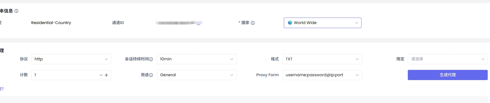

# irys_faucet

# 根据 @Xuegaogx 代码修改的, 改成了用动态ip接口获取ip进行领水，增加重试

# Irys领水bot

## 需要yescaptcha

注册：https://yescaptcha.com/i/wjyxFm

``` API_KEY: ``` 注册：https://yescaptcha.com/i/WJIg9a
获取
``` PROXY_API_URL: ```动态ip接口 我用的这个https://app.nstproxy.com/ 格式看我下图


```MAX_RETRIES: ```最大重试次数


1. 克隆此仓库：
   ```bash
   git clone https://github.com/Gzgod/irys.git
   cd irys
   ```
2. 安装依赖：
   ```bash
   npm install
   ```
3. 运行脚本
   ```bash
   node bot.js
   ```